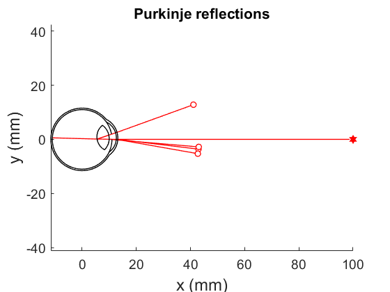

# Magic Beam
Two-dimensional optical modeling package written in object-oriented MATLAB with a focus on human optics. Originally developed by Jacob Duijnhouwer at Magic Leap, Inc.

## Installation
Add the magic_beam folder to your Matlab path. There are many ways to this. One way is to drag the magic_beam folder onto the Matlab command window. This will change the working directory to the magic_beam folder. Then run: `addpath(pwd); savepath` and you're done. There's no need to add subfolders because all code is inside package folders (starting with a `+`, e.g. `+mb`). Test if it worked by running `mb.examples.purkinje`. It should produce a figure similar to the one below.

